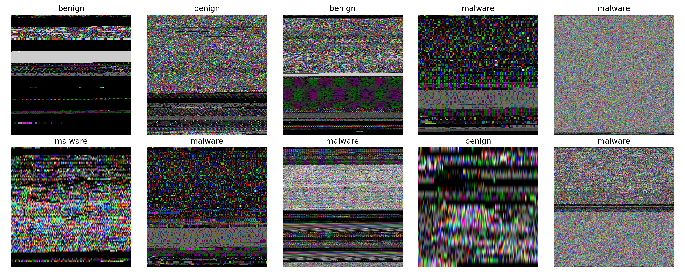
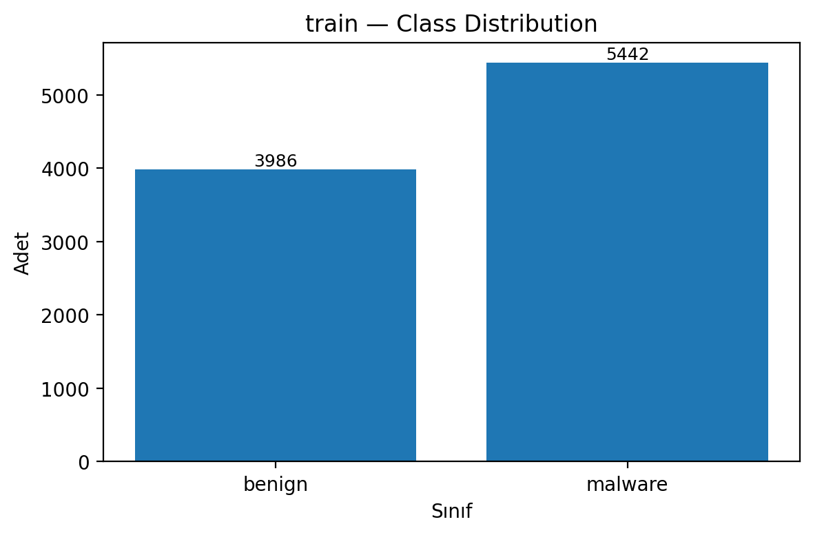
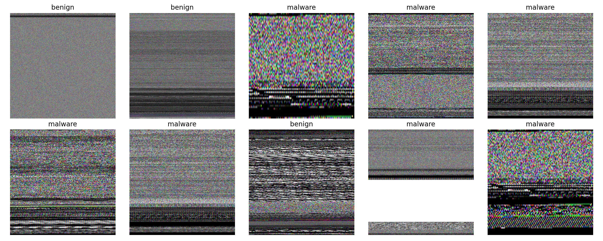
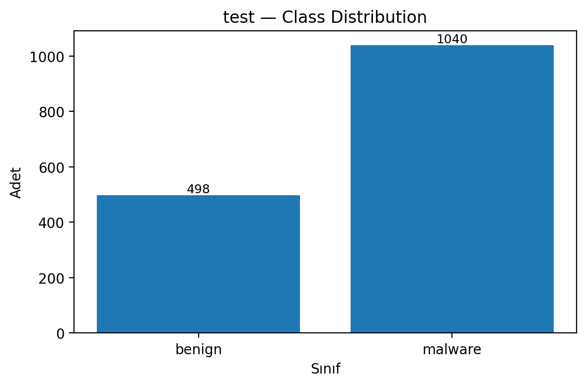
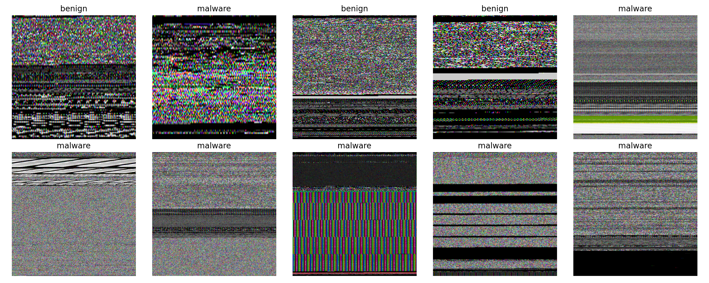
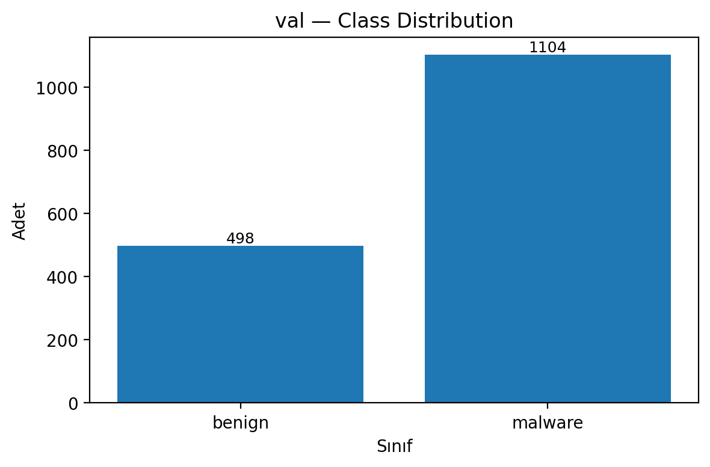
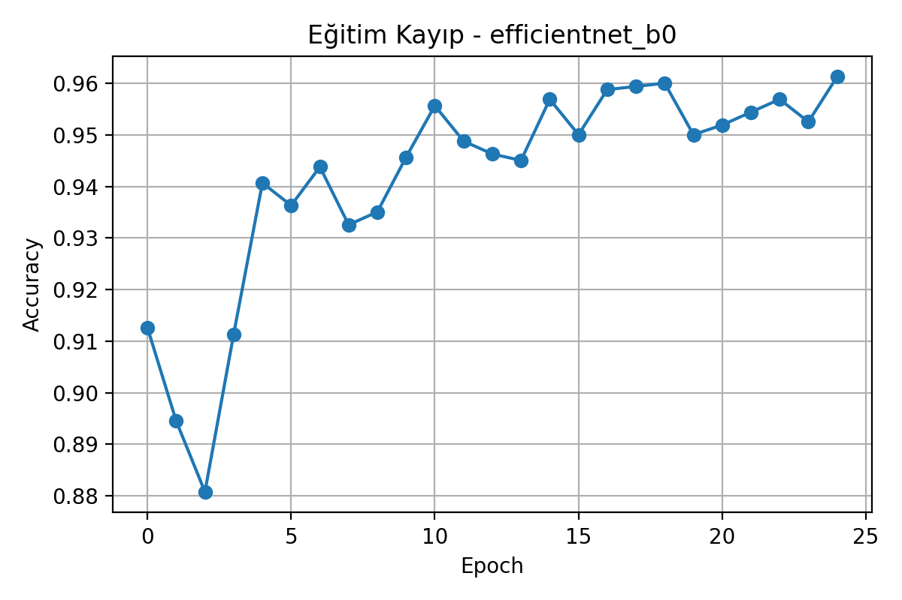
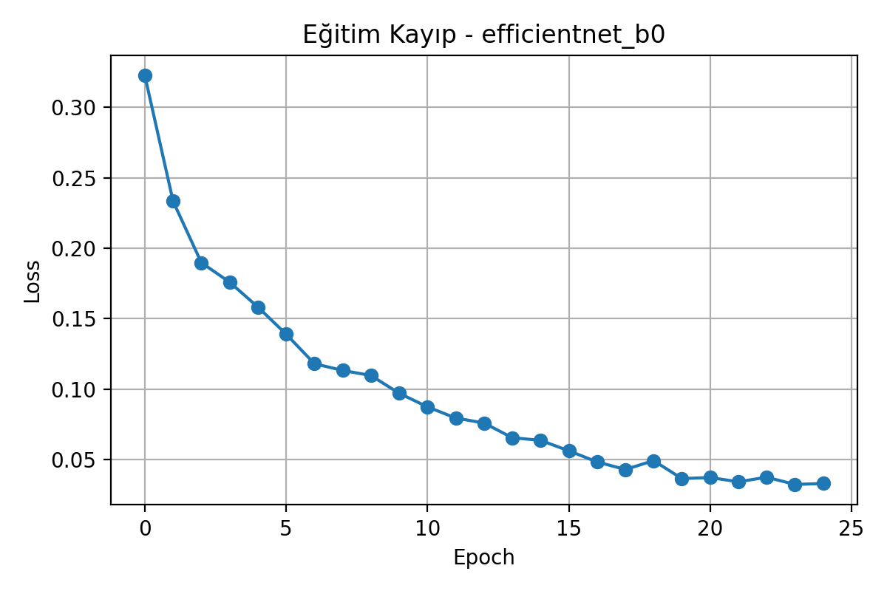

# Malware Image Classification

## Overview
This project tackles malware detection by transforming binary files into **RGB images** and applying **deep learning classification**.  
The dataset contains over **12,000 RGB images** of both **malicious** and **benign** binaries.  
Using **transfer learning** across multiple CNN architectures, the models achieve up to **98% accuracy**, with stable results around **96.5%**.  

The codebase is designed to be **modular and extensible** — you can swap models or configurations with minimal changes.

---

## Dataset
The dataset used is publicly available on Kaggle:  
👉 [Malebin RGB Malware Binary Dataset](https://www.kaggle.com/datasets/tashiee/malebin-rgb-malware-binary-dataset)

Sources of the dataset:
- **Malicious samples:** RGB visualizations of malware binaries.  
- **Benign samples:** Clean executables collected from Windows systems and freeware applications.  

All binaries were converted into **224x224 RGB images** for consistency.

---

## Dataset Samples
A few random samples from the dataset:

### Train Dataset

  
  

### Test Dataset

  
  

### Validation Dataset

  
  

## Project Structure
- `config.py` → Centralized constants (paths, hyperparameters, model choice).  
- `data_inspector.py` → Dataset inspection utilities (class counts, distributions, random samples).  
- `scripts/train.py` → Training pipeline with transfer learning support.  
- `scripts/test.py` → Model test script. Contains the `test_model()` function:
- `scripts/evaluate.py` → Model evaluation script. Contains the `evaluate()` function:
- `utils/` → Helper functions (dataloader, visualization, data_inspector).  
- `charts/` → Experiment results: accuracy/loss curves, confusion matrices, logs.  
- 
---

## Experiments
- All models trained on **224x224 inputs**.  
- **Transfer Learning** tested on multiple CNNs (both lightweight and heavier ones).  
- Key results:
  - **Max accuracy:** ~97%  
  - **Stable range:** 96–97%  
  - Lightweight models reached performance close to heavier ones, proving efficiency.  

Modular design allows **one-line model switching** in `config.py`.

---

## Results
Training/validation accuracy & loss curves under **`charts/`**.  
Historical experiment logs included for reproducibility.  
Across models, the accuracy consistently remained high, with negligible variance between architectures.

---

## Example Training Results
Below are example results from the **EfficientNet** model:

  
  

